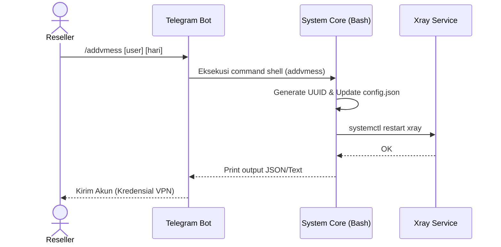

# Dokumentasi Proyek PANELXRAY

## 1. Deskripsi Program
PANELXRAY adalah sebuah panel manajemen VPS berbasis Bash script yang dirancang untuk memudahkan instalasi, pengelolaan, dan pemeliharaan berbagai layanan tunneling VPN (SSH, OpenVPN, dan Xray seperti VMESS, VLESS, TROJAN, dan SHADOWSOCKS). Proyek ini dilengkapi dengan antarmuka menu berbasis Command Line (CLI), integrasi Bot Telegram untuk manajemen jarak jauh, fitur pembatasan (limit) IP dan kuota, pencadangan dan pemulihan (backup/restore), serta pembaruan otomatis (auto-update).

## 2. Fungsi Program
Fungsi utama program ini meliputi:
- **Manajemen Akun:** Membuat (create), memperbarui (renew), menghapus (delete), dan memeriksa (check) akun untuk layanan SSH, VMESS, VLESS, TROJAN, dan SHADOWSOCKS.
- **Suspend/Unsuspend Akun:** Menghentikan sementara dan mengaktifkan kembali akun pengguna Xray (VMESS/VLESS/TROJAN).
- **Auto Limit IP:** Melakukan suspend otomatis pada akun yang melanggar batas penggunaan IP, tanpa menghapusnya secara permanen.
- **Integrasi Bot Telegram:** Memungkinkan Admin/Reseller melakukan operasi manajemen akun langsung dari aplikasi Telegram.
- **Backup & Restore:** Mencadangkan data konfigurasi dan database akun, serta memulihkannya jika diperlukan.
- **Maintenance Tools:** Menghapus log sistem, memulai ulang (restart) layanan, memeriksa daftar akun yang disuspend, dan menjalankan speedtest.

## 3. Arsitektur
Arsitektur program ini dirancang sebagai kumpulan script Shell/Bash modular yang dijalankan di atas OS Linux (Ubuntu/Debian). 
- **Core Scripts (Wrapper):** Terletak di direktori utama, berfungsi sebagai titik masuk dan menjaga kompatibilitas dengan eksekusi perintah gaya lama (legacy support).
- **Script Modul Utama:** Terletak dalam direktori `scripts/install/` dan `scripts/maintenance/`.
- **Runtime & Assets:** Tersimpan dalam folder `limit/` dan `menu/`, diunduh saat instalasi (atau ditarik melalui repository clone jika tidak ada), yang diinstal ke dalam sistem (misal `/usr/bin/` atau direktori `/etc/kyt/`).
- **Bot Layer:** Skrip terpisah yang berkomunikasi dengan Telegram Bot API untuk meneruskan perintah ke backend sistem.

## 4. Alur Aktor (Actor Flow)
Terdapat beberapa aktor utama dalam sistem:
- **Admin Server (Root):** Memiliki akses penuh. Melakukan instalasi awal `premi.sh`, mengatur konfigurasi bot Telegram, memperbarui sistem, dan memiliki kendali penuh atas shell.
- **Reseller / Sub-Admin:** Menggunakan Bot Telegram atau sub-menu SSH untuk membuat akun dan mengelola masa aktif klien tanpa perlu mengakses konfigurasi internal server.
- **Client (End User):** Menerima kredensial login (SSH/VMESS/dll), menghubungkan aplikasi VPN mereka (seperti HTTP Injector, V2Ray, dll) ke port server yang ditentukan.

## 5. Alur Sistem (System Flow)
1. **Instalasi Awal:** Admin menjalankan `premi.sh`. Script akan memperbarui paket OS, mengunduh aset dari repositori, menginstal layanan inti (Nginx, Xray-core, OpenVPN, Dropbear, dll), dan mengatur konfigurasi awal.
2. **Pembuatan Akun:** Admin (via menu CLI) atau Reseller (via Telegram Bot) meminta pembuatan akun `m-vmess` (contoh). Script `menu` memanggil file biner terkait, mengenerate UUID, menambahkan data ke konfigurasi Xray (`/etc/xray/config.json`), dan mere-start layanan Xray.
3. **Pengecekan Kuota/IP (Auto Limit):** Script yang berjalan via cron job (`limit-ip-ssh` dsb) secara berkala membaca log. Jika IP melebihi batas, akun dipindahkan ke daftar `/etc/kyt/suspended/...` dan aksesnya diputus.
4. **Maintenance:** Saat admin menjalankan `update.sh`, sistem mengunduh script terbaru dari GitHub dan menimpa script lama untuk memastikan fungsionalitas selalu up-to-date.

## 6. Hierarki Folder (Folder Hierarchy)
Struktur direktori workspace ini disusun sebagai berikut:
```text
vpnxray-main/
├── .git/                      # Repositori Git internal
├── .venv/                     # (Opsional) Virtual environment Python
├── PROJECT_STRUCTURE.md       # Catatan tentang restrukturisasi proyek baru
├── README.md                  # Dokumentasi instalasi dan kompatibilitas utama
├── add-ip                     # Skrip manajemen IP Address server/panel
├── debian.sh                  # Skrip utama (legacy wrapper) instalasi Debian
├── kunci                      # Berkas terkait enkripsi/autentikasi (jika relevan)
├── kyt.sh                     # Skrip (legacy wrapper) pemeliharaan kyt
├── limit/                     # Direktori aset limit, bot, konfigurasi runtime
│   ├── bot/                   # Aset script bot telegram
│   ├── menu/                  # Aset script menu utama
│   └── kyt/                   # Aset kyt runtime
├── limit-ip-ssh               # Skrip pengecekan dan eksekusi limit IP akun SSH
├── menu/                      # Folder skrip menu interaktif
├── menu1122.sh                # Varian/backup skrip menu panel interaktif
├── premi.sh                   # Skrip installer (legacy wrapper) premium/utama
├── rc                         # File rc (konfigurasi startup/environment)
├── scripts/                   # Direktori modular utama baru
│   ├── install/               # Skrip instalasi spesifik (debian.sh, premi.sh)
│   └── maintenance/           # Skrip update, testing, kyt.sh, udp-custom.sh
├── test.sh                    # Skrip (legacy wrapper) pengujian/diagnostik
├── udp-custom.sh              # Skrip konfigurasi layanan UDP Custom
└── update.sh                  # Skrip pembaruan modul (auto-update wrapper)
```

## 7. Diagram UML

### Use Case Diagram
```mermaid
usecaseDiagram
    actor Admin
    actor Reseller
    actor Client
    
    package "Panel Xray VPS" {
        usecase "Install & Konfigurasi" as UC1
        usecase "Buat/Hapus Akun VPN" as UC2
        usecase "Suspend/Unsuspend Akun" as UC3
        usecase "Backup/Restore" as UC4
        usecase "Gunakan Layanan VPN" as UC5
    }
    
    Admin --> UC1
    Admin --> UC2
    Admin --> UC3
    Admin --> UC4
    Reseller --> UC2
    Reseller --> UC3
    Client --> UC5
```

### System Architecture / Flow (Sequence Diagram) - Pembuatan Akun via Bot


## 8. Penjelasan Tambahan
- **Wrapper Script:** Skrip seperti `premi.sh` dan `debian.sh` pada root folder akan bertindak sebagai wrapper, yang secara otomatis memanggil versi terbaru script di direktori `scripts/`. Hal ini ditujukan agar tutorial instalasi lama (`wget -qO ~/premi.sh ... && bash ~/premi.sh`) tidak error (backward compatible).
- **Limit Otomatis:** Fitur auto limit tidak menghapus akun secara permanen melainkan memindahkannya ke mode "suspend" (`/etc/kyt/suspended/...`). Akun ini bisa di-unsuspend sewaktu-waktu oleh admin menggunakan perintah seperti `unsuspws`, `unsuspvless`, dll.
- **Port:** Sistem dikonfigurasi untuk menjalankan berbagai port secara terorganisir (misalnya port 443 untuk komunikasi berbasis WS/GRPC/TLS dan 80 untuk Non-TLS) agar efisien dengan proxying Nginx / HAProxy / Xray-core bawaan.
