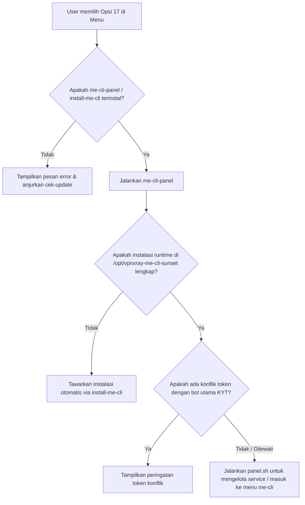

# Dokumentasi Modul 17: MYnyak Engsel Panel (me-cli / xl-cli) pada PANELXRAY

## 1. Deskripsi Program
**MYnyak Engsel (me-cli / xl-cli)** adalah modul opsional pada **PANELXRAY** yang berfungsi sebagai klien Command Line Interface (CLI) dan Bot Telegram untuk berinteraksi langsung dengan API resmi salah satu provider telekomunikasi di Indonesia (XL Axiata). 

Modul ini dikodekan menggunakan Python dan memungkinkan pengguna untuk mengelola akun XL (seperti login via OTP, melihat pulsa/paket, mendaftar paket baru, dll.) secara interaktif melalui terminal Linux atau antarmuka bot Telegram yang berjalan di latar belakang (background service).

---

## 2. Alur Integrasi Menu Nomor 17

Di dalam menu utama PANELXRAY (`menu/menu`), opsi nomor **17** didefinisikan sebagai **"MYNYAK ENGSEL PANEL (OPSIONAL)"**. Berikut adalah alur eksekusi ketika opsi ini dipilih:

---

## 3. Komponen dan Struktur Berkas Terkait

Berikut adalah berkas-berkas penting di dalam repositori PANELXRAY yang mengatur jalannya modul MYnyak Engsel:

### A. Skrip Integrasi Sistem (Bash & Sistem Operasi)
1. **`menu/menu`** (Entry Point):
   * Berfungsi sebagai menu navigasi utama panel VPN.
   * Pada baris pemilihan opsi `17)`, skrip mendeteksi file biner/skrip `me-cli-panel` atau `install-me-cli`, lalu mengeksekusinya.
2. **`menu/me-cli-panel`** (Controller Panel):
   * Bertanggung jawab memeriksa apakah instalasi modul di direktori `/opt/vpnxray-me-cli-sunset` sudah lengkap.
   * Melakukan verifikasi keamanan untuk mendeteksi apakah token bot Telegram (`TELEGRAM_BOT_TOKEN`) bentrok dengan token bot utama panel VPN (`BOT_TOKEN` di `/usr/bin/kyt/var.txt`).
   * Membuka panel control control-flow (`panel.sh`).
3. **`menu/install-me-cli`** (Installer Script):
   * Menginstal dependensi sistem yang dibutuhkan seperti `python3`, `python3-venv`, `python3-pip`, `build-essential`, `git`, dan `curl`.
   * Mengambil kode sumber dari repositori upstream `https://github.com/dalifajr/xl-cli.git` atau menyalin dari cache direktori lokal `limit/me-cli-sunset-main`.
   * Melakukan sinkronisasi berkas ke `/opt/vpnxray-me-cli-sunset` tanpa menimpa berkas data pengguna yang sudah ada (misal `.env`, token login, bookmark, dll.).
   * Menyiapkan Python Virtual Environment (`.venv`) dan memasang pustaka dari `requirements.txt`.

### B. Kode Sumber Program Utama (Python & Engine)
Terletak di direktori `limit/me-cli-sunset-main/` (setelah terinstal dipindahkan ke `/opt/vpnxray-me-cli-sunset/`):

1. **`main.py`** (Interactive CLI Menu):
   * Titik masuk utama jika aplikasi dijalankan secara manual via CLI terminal.
   * Menampilkan informasi akun aktif: nomor HP, jenis layanan (Prepaid/Postpaid), sisa pulsa, masa aktif, poin, dan tier loyalti.
   * Menyediakan menu interaktif untuk login/ganti akun, cek paket aktif, beli paket promo/HOT, beli paket via Option Code/Family Code (loop buy), riwayat transaksi, manajemen Family Plan/Circle, registrasi NIK/KK, dan validasi MSISDN.
2. **`telegram_main.py`** (Telegram Bot Backend):
   * Program backend untuk Telegram Bot yang mendukung alur kerja berbasis tombol interaktif (*button-first design*).
   * Mendukung mode **Native** (tombol kontekstual langsung di Telegram) dan mode **Bridge** (menghubungkan langsung jalannya `main.py` ke antarmuka chat Telegram).
   * Keamanan bot dikontrol melalui file `user_allow.txt` (hanya ID Telegram yang terdaftar yang dapat mengontrol bot).
3. **`panel.sh`** (Process Controller Daemon):
   * Berfungsi sebagai pengontrol proses latar belakang (background) untuk memulai (`start`), menghentikan (`stop`), mengecek status (`status`), dan membaca log dari Telegram Bot (`telegram_bot.pid`) maupun CLI daemon.
4. **`app/client/engsel.py`** (API Engine Client):
   * Berisi logika komunikasi API ke server provider.
   * Menggunakan pengaman enkripsi dan tanda tangan digital (`encryptsign_xdata` & `decrypt_xdata`) untuk memvalidasi request ke endpoint resmi.
   * Mengirimkan payload JSON yang valid dengan headers khusus (`x-api-key`, `x-signature`, `x-version-app: 8.9.0`, dll.).

---

## 4. Fitur Utama yang Disediakan oleh Modul MYnyak Engsel

Modul ini memiliki fungsionalitas lengkap untuk memanipulasi dan membeli paket layanan internet XL Axiata:

| Fitur | Deskripsi |
|---|---|
| **Login & Switch Account** | Autentikasi aman menggunakan OTP yang langsung dikirim ke nomor HP XL Anda. Token disimpan lokal dalam `refresh-tokens.json`. |
| **Check Active Packages** | Melihat detail kuota internet, telepon, sms, dan masa aktif paket yang sedang aktif saat ini. |
| **Purchase HOT/HOT-2 Deals** | Mengakses paket-paket promo khusus dengan harga lebih murah yang biasanya hanya muncul di aplikasi resmi mobile. |
| **Purchase by Option/Family Code** | Membeli paket internet tersembunyi dengan cara memasukkan kode opsi paket (`Option Code`) atau kode keluarga (`Family Code`) secara langsung. |
| **Loop Purchase Family Code** | Fitur otomatisasi untuk mencoba membeli semua paket yang berada dalam satu kode keluarga paket secara berulang. |
| **Transaction History** | Menampilkan daftar riwayat transaksi pembelian pulsa atau paket lengkap dengan status sukses/gagal. |
| **Family Plan & Circle** | Mengelola anggota paket Akrab (Family Plan) dan Circle langsung dari aplikasi. |
| **Dukcapil Registration** | Melakukan registrasi kartu perdana baru dengan memasukkan NIK dan nomor Kartu Keluarga (KK). |
| **Telegram Bot Interface** | Menjalankan seluruh fungsi CLI di atas melalui Bot Telegram pribadi yang aman dan responsif. |

---

## 5. Konfigurasi dan Keamanan

* **Berkas `.env`**:
  Berisi variabel lingkungan krusial seperti:
  * `TELEGRAM_BOT_TOKEN`: Token bot Telegram Anda.
  * `BASE_API_URL` & `UA` (User-Agent): Konfigurasi endpoint target.
* **Berkas `user_allow.txt`**:
  Digunakan untuk membatasi akses Telegram Bot. Hanya pengguna dengan ID Telegram yang terdaftar di dalam file ini (satu ID per baris) yang dapat mengakses bot.
* **Penanganan Konflik Token**:
  Jika token bot Telegram MYnyak Engsel sama dengan token bot utama panel VPN (KYT), disarankan untuk menggantinya demi mencegah bentrokan proses *polling* Telegram API yang dapat menyebabkan bot macet.
